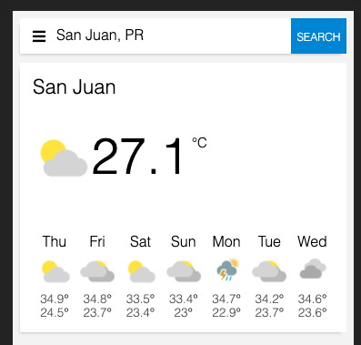
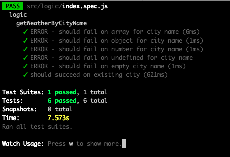

## [Live App](https://nicopixel-weather-app.netlify.app/)
Everyone has a weather app in his repository. Here the mine:

This App is built with the following technologies:
- React (no hooks over here)
- SASS
- Javascript

#### API - www.weatherbit.io
I'm using the free version of forecast API by [weatherbit](https://www.weatherbit.io/). It has a limitation of 500 API calls per day.

#### Test build with Jasmine

